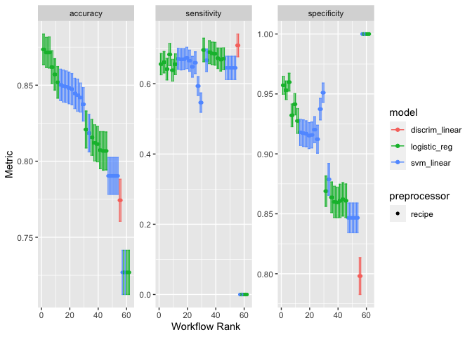

README
================

## Background

This project is for implementing the statistical and machine learning
techniques from reading the 2nd edition of Introduction to Statistical
Learning. The implementation will use {targets} and the. {tidymodels}
collection of packages will be the main functionality used.

``` r
library(tidymodels)
```

    ## ── Attaching packages ────────────────────────────────────── tidymodels 1.1.1 ──

    ## ✔ broom        1.0.5     ✔ recipes      1.0.8
    ## ✔ dials        1.2.0     ✔ rsample      1.2.0
    ## ✔ dplyr        1.1.2     ✔ tibble       3.2.1
    ## ✔ ggplot2      3.4.3     ✔ tidyr        1.3.0
    ## ✔ infer        1.0.4     ✔ tune         1.1.2
    ## ✔ modeldata    1.2.0     ✔ workflows    1.1.3
    ## ✔ parsnip      1.1.1     ✔ workflowsets 1.0.1
    ## ✔ purrr        1.0.2     ✔ yardstick    1.2.0

    ## ── Conflicts ───────────────────────────────────────── tidymodels_conflicts() ──
    ## ✖ purrr::discard() masks scales::discard()
    ## ✖ dplyr::filter()  masks stats::filter()
    ## ✖ dplyr::lag()     masks stats::lag()
    ## ✖ recipes::step()  masks stats::step()
    ## • Search for functions across packages at https://www.tidymodels.org/find/

``` r
library(discrim)
```

    ## 
    ## Attaching package: 'discrim'

    ## The following object is masked from 'package:dials':
    ## 
    ##     smoothness

``` r
library(MASS)
```

    ## 
    ## Attaching package: 'MASS'

    ## The following object is masked from 'package:dplyr':
    ## 
    ##     select

``` r
all_data <- modeldata::ad_data |> mutate(male = factor(male,levels=c(0,1)))
rsplits <- rsample::initial_split(all_data)
train_data <- training(rsplits)
val_data <- testing(rsplits)

outcome_vars <- "Class"
predictor_vars <- setdiff(colnames(train_data),outcome_vars)
all_vars <- c(outcome_vars,predictor_vars)
var_roles <- c(
    rep("outcome",length(outcome_vars)),
    rep("predictor",length(predictor_vars))
)

base_rec <- 
    recipe(train_data,vars=all_vars,roles=var_roles) |> 
    step_dummy(all_nominal_predictors())
norm_rec <- 
    recipe(train_data,vars=all_vars,roles=var_roles) |> 
    step_normalize(all_numeric_predictors()) |> 
    step_dummy(all_nominal_predictors())

specs <- 
  list(
    "Logit" = parsnip::logistic_reg(penalty = tune(),mixture = tune()) |> parsnip::set_engine("glmnet"),
    "LDA" = parsnip::discrim_linear(regularization_method = "diagonal",penalty = 1) |> set_engine("MASS"),
    "SVM" = svm_linear(cost = tune(), margin = tune()) %>% set_engine("kernlab") %>% set_mode("classification")
  )

folds <- vfold_cv(train_data,v = 10,repeats = 10)

set.seed(8241)
doParallel::registerDoParallel()
wf_set <- workflow_set(
    preproc = list(
        base = base_rec,
        normalized = norm_rec
        ),
    models = specs
)
res <- 
    workflow_map(
    wf_set,
    fn = 'tune_bayes',
    resamples = folds,
    verbose = TRUE,
    metrics = metric_set(accuracy, sensitivity, specificity)
)
```

    ## i 1 of 6 tuning:     base_Logit

    ## ✔ 1 of 6 tuning:     base_Logit (1m 16.8s)

    ## i    No tuning parameters. `fit_resamples()` will be attempted

    ## i 2 of 6 resampling: base_LDA

    ## ✔ 2 of 6 resampling: base_LDA (4.1s)

    ## i 3 of 6 tuning:     base_SVM

    ## ✔ 3 of 6 tuning:     base_SVM (1m 27.6s)

    ## i 4 of 6 tuning:     normalized_Logit

    ## ✔ 4 of 6 tuning:     normalized_Logit (1m 24.7s)

    ## i    No tuning parameters. `fit_resamples()` will be attempted

    ## i 5 of 6 resampling: normalized_LDA

    ## ✔ 5 of 6 resampling: normalized_LDA (5.1s)

    ## i 6 of 6 tuning:     normalized_SVM

    ## ✔ 6 of 6 tuning:     normalized_SVM (1m 42.4s)

``` r
autoplot(res)
```

<!-- -->
