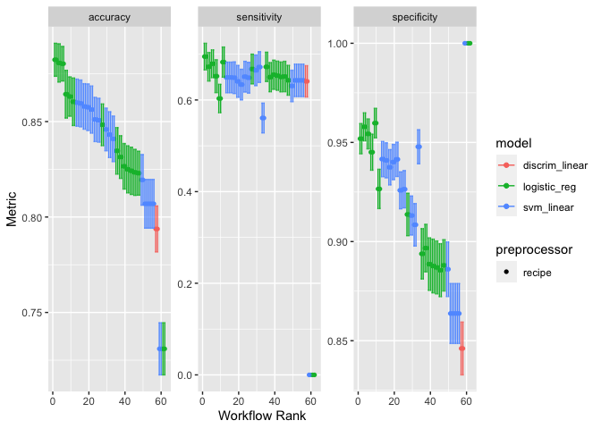

README
================

## Background

This project is for implementing the statistical and machine learning
techniques from reading the 2nd edition of Introduction to Statistical
Learning. I want to grow my understanding and usage of
prediction/inference techniques. I also want to use the language `R`
since there are reliable and versatile APIs from the {tidymodels}
collection of packages. Also, the visualization of the outputs will be a
lot better and easier if I stay within the `R` environment and use the
{ggplot2} package.

I will eventually use {targets} to orchestrate the modeling pipeline.
There are many steps involved when using these techniques and as the
number of steps grow it will be hard to keep track of the analysis
components. To enforce reproducibility and keep track of the analysis
pipeline, I will eventually use {targets} to orchestrate the pipeline as
it grows. There are a few main components that will be part of the
pipeline:

- Dataset selection
- Exploratory data analysis
- Feature Selection & Engineering
- Model Training
- Model Evaluation
- Model Testing

First, I will be selecting different datasets for both applying
classification and regression techniques. In both cases, I will choose a
response variable but the predictors will be automatically selected from
the other variables in the dataset. Next, I will produce different plots
and summaries to have an understanding of the relationship between the
response and potential predictors. Next, I will perform feature
selection using the LASSO technique to identify predictors related to
the response. I will utilize the bootstrap to identify the predictors
with a non-zero relationship to the response. Using these predictors, I
will then train a pre-defined set of models. I will utilize cross
validation and different hyperparameter tuning techniques to evaluate
the best performing model that maximizes the tradeoff between
sensitivity and specificity (the roc_auc metric). Then using the maximal
model, I will retrain te model on the entire training dataset to derive
the predictor importances to the response. Lastly I will predict the
held out test data and compare the different model performances.

``` r
library(tidymodels)
```

    ## ── Attaching packages ────────────────────────────────────── tidymodels 1.1.1 ──

    ## ✔ broom        1.0.5     ✔ recipes      1.0.8
    ## ✔ dials        1.2.0     ✔ rsample      1.2.0
    ## ✔ dplyr        1.1.3     ✔ tibble       3.2.1
    ## ✔ ggplot2      3.4.3     ✔ tidyr        1.3.0
    ## ✔ infer        1.0.5     ✔ tune         1.1.2
    ## ✔ modeldata    1.2.0     ✔ workflows    1.1.3
    ## ✔ parsnip      1.1.1     ✔ workflowsets 1.0.1
    ## ✔ purrr        1.0.2     ✔ yardstick    1.2.0

    ## ── Conflicts ───────────────────────────────────────── tidymodels_conflicts() ──
    ## ✖ purrr::discard() masks scales::discard()
    ## ✖ dplyr::filter()  masks stats::filter()
    ## ✖ dplyr::lag()     masks stats::lag()
    ## ✖ recipes::step()  masks stats::step()
    ## • Use tidymodels_prefer() to resolve common conflicts.

``` r
library(discrim)
```

    ## 
    ## Attaching package: 'discrim'

    ## The following object is masked from 'package:dials':
    ## 
    ##     smoothness

``` r
library(MASS)
```

    ## 
    ## Attaching package: 'MASS'

    ## The following object is masked from 'package:dplyr':
    ## 
    ##     select

``` r
all_data <- modeldata::ad_data |> mutate(male = factor(male,levels=c(0,1)))
rsplits <- rsample::initial_split(all_data)
train_data <- training(rsplits)
val_data <- testing(rsplits)

outcome_vars <- "Class"
predictor_vars <- setdiff(colnames(train_data),outcome_vars)
all_vars <- c(outcome_vars,predictor_vars)
var_roles <- c(
    rep("outcome",length(outcome_vars)),
    rep("predictor",length(predictor_vars))
)

base_rec <- 
    recipe(train_data,vars=all_vars,roles=var_roles) |> 
    step_dummy(all_nominal_predictors())
norm_rec <- 
    recipe(train_data,vars=all_vars,roles=var_roles) |> 
    step_normalize(all_numeric_predictors()) |> 
    step_dummy(all_nominal_predictors())

specs <- 
  list(
    "Logit" = parsnip::logistic_reg(penalty = tune(),mixture = tune()) |> parsnip::set_engine("glmnet"),
    "LDA" = parsnip::discrim_linear(regularization_method = "diagonal",penalty = 1) |> set_engine("MASS"),
    "SVM" = svm_linear(cost = tune(), margin = tune()) %>% set_engine("kernlab") %>% set_mode("classification")
  )

folds <- vfold_cv(train_data,v = 10,repeats = 10)

set.seed(8241)
doParallel::registerDoParallel()
wf_set <- workflow_set(
    preproc = list(
        base = base_rec,
        normalized = norm_rec
        ),
    models = specs
)
res <- 
    workflow_map(
    wf_set,
    fn = 'tune_bayes',
    resamples = folds,
    verbose = TRUE,
    metrics = metric_set(accuracy, sensitivity, specificity)
)
```

    ## i 1 of 6 tuning:     base_Logit

    ## ✔ 1 of 6 tuning:     base_Logit (1m 15.7s)

    ## i    No tuning parameters. `fit_resamples()` will be attempted

    ## i 2 of 6 resampling: base_LDA

    ## ✔ 2 of 6 resampling: base_LDA (3.9s)

    ## i 3 of 6 tuning:     base_SVM

    ## ✔ 3 of 6 tuning:     base_SVM (1m 28.1s)

    ## i 4 of 6 tuning:     normalized_Logit

    ## ✔ 4 of 6 tuning:     normalized_Logit (1m 26.5s)

    ## i    No tuning parameters. `fit_resamples()` will be attempted

    ## i 5 of 6 resampling: normalized_LDA

    ## ✔ 5 of 6 resampling: normalized_LDA (4.9s)

    ## i 6 of 6 tuning:     normalized_SVM

    ## ✔ 6 of 6 tuning:     normalized_SVM (1m 53.7s)

``` r
autoplot(res)
```

<!-- -->
