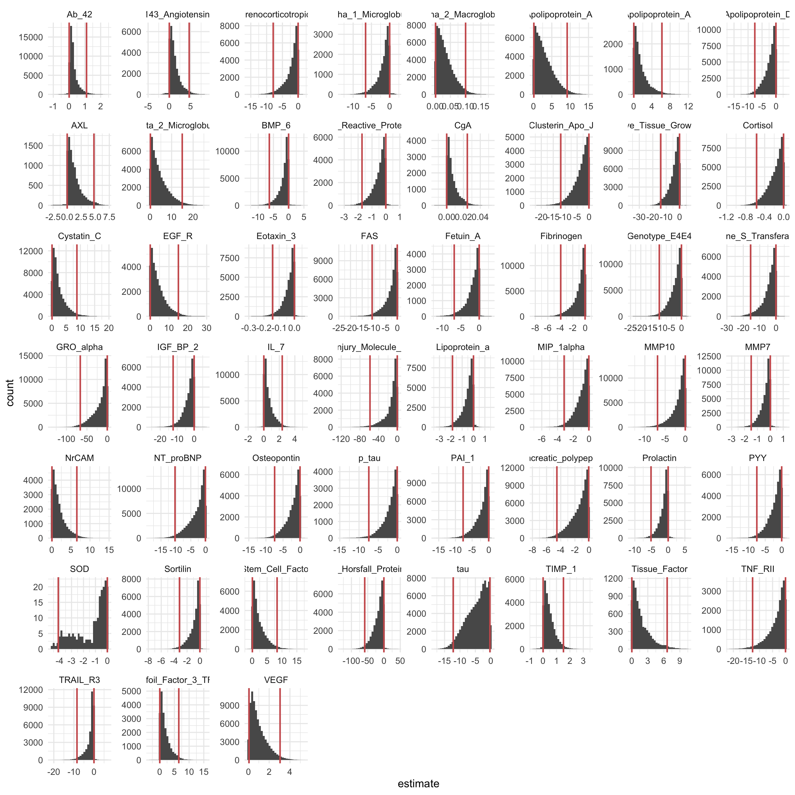
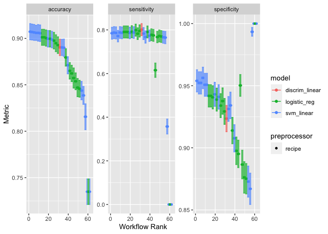

# README

## Background

This project is intended for implementing statistical and machine
learning techniques in the 2nd edition of Introduction to Statistical
Learning. I want to grow my understanding and usage of
prediction/inference techniques while using the versatile APIs from the
{tidymodels} collection of `R` packages. Also, the visualization of the
outputs will be a lot better and easier if I stay within the `R`
environment and use the {ggplot2} package.

I will eventually use {targets} to orchestrate the modeling pipeline.
There are many steps involved when using these techniques and as the
number of steps grow it will be hard to keep track of the analysis
components. To enforce reproducibility and keep track of the analysis
pipeline, I will eventually use {targets} to orchestrate the pipeline as
it grows. There are a few main components that will be part of the
pipeline:

- Dataset selection
- Exploratory data analysis
- Feature Selection & Engineering
- Model Training
- Model Evaluation
- Model Testing

First, I will be selecting different datasets for both applying
classification and regression techniques. In both cases, I will choose a
response variable but the predictors will be automatically selected from
the other variables in the dataset. The datasets will be high
dimensional but there will be various different datasets. Next, I will
produce different plots and summaries to have an understanding of the
relationship between the response and potential predictors. Next, I will
perform feature selection using the LASSO technique to identify
predictors related to the response. I will utilize the bootstrap to
identify the predictors with a non-zero relationship to the response.
Using these predictors, I will then train a pre-defined set of
prediction models. I will utilize cross validation and different
hyperparameter tuning techniques to evaluate the best performing model
that maximizes the tradeoff between sensitivity and specificity (the
roc_auc metric). Then using the maximal model, I will retrain the model
on the entire training dataset to infer the predictor importances to the
response. Lastly I will predict the held out test data and compare the
different model performances.

For ensuring correct parameterization and using the correct functions, I
will also eventually use object oriented programming. For a given
dataset, there are a few attributes such as

- Data
- Data Predictors
- Data Response
- Data Training and Testing Datasets
- LASSO model tuning results
- LASSO selected predictors
- Prediction model tuning results
- Prediction model prediction results

As a beginning step, I will try to execute this pipeline for one
example.

``` r
library(tidymodels)
library(discrim)
library(MASS)
```

``` r
all_data <- modeldata::ad_data |> mutate(male = factor(male,levels=c(0,1)))
rsplits <- rsample::initial_split(all_data)
train_data <- training(rsplits)
val_data <- testing(rsplits)
```

``` r
outcome_vars <- "Class"
predictor_vars <- setdiff(colnames(train_data),outcome_vars)
all_vars <- c(outcome_vars,predictor_vars)
var_roles <- c(
    rep("outcome",length(outcome_vars)),
    rep("predictor",length(predictor_vars))
)

lasso_recipe <- 
    recipe(train_data,vars=all_vars,roles=var_roles) |> 
    step_dummy(all_nominal_predictors())
lasso_model <- parsnip::logistic_reg(mode = "classification",engine = "glmnet",mixture = 1,penalty = 1)
lasso_wf <- 
    workflow() |> 
            add_model(lasso_model) |> 
            add_recipe(lasso_recipe)
lasso_cvs <- vfold_cv(train_data,v = 10,repeats = 10)
lasso_resamples <- vfold_cv(train_data,v = 10,repeats = 10)
```

``` r
lasso_model <- parsnip::logistic_reg(mode = "classification",engine = "glmnet",mixture = 1,penalty = 1)
lasso_wf <- 
    workflow() |> 
            add_model(lasso_model) |> 
            add_recipe(lasso_recipe)
boot_models <- 
    bootstraps(train_data,1000) |> 
    mutate(model = purrr::map(splits,~{
        lasso_wf |> 
            fit(data=analysis(.x)) |> 
            extract_fit_engine()
    }),
    coef_info = map(model, tidy))

boot_coefs <- 
    boot_models |> 
    unnest(coef_info)

percentile_intervals <- int_pctl(boot_models, coef_info)
selected_predictors <- setdiff(
                   percentile_intervals |> filter((.lower>0 & .upper>0) | (.lower<0 & .upper<0)) |> pull(term),
                   "Intercept"
               )
ggplot(boot_coefs |> 
           filter(term %in% (
               selected_predictors
           )), aes(estimate)) +
  geom_histogram(bins = 30) +
  facet_wrap( ~ term, scales = "free") +
  geom_vline(aes(xintercept = .lower), data = percentile_intervals, col = "blue") +
  geom_vline(aes(xintercept = .upper), data = percentile_intervals, col = "blue")
```



``` r
predictor_vars <- intersect(selected_predictors,all_vars)
all_vars <- c(outcome_vars,predictor_vars)
var_roles <- c(
    rep("outcome",length(outcome_vars)),
    rep("predictor",length(predictor_vars))
)

base_recipe <- 
    recipe(train_data,vars=all_vars,roles=var_roles) |> 
    step_dummy(all_nominal_predictors())
norm_recipe <- 
    recipe(train_data,vars=all_vars,roles=var_roles) |> 
    step_normalize(all_numeric_predictors()) |> 
    step_dummy(all_nominal_predictors())

specs <- 
  list(
    "Logit" = parsnip::logistic_reg(penalty = tune(),mixture = tune()) |> parsnip::set_engine("glmnet"),
    "LDA" = parsnip::discrim_linear(regularization_method = "diagonal",penalty = 1) |> set_engine("MASS"),
    "SVM" = svm_linear(cost = tune(), margin = tune()) %>% set_engine("kernlab") %>% set_mode("classification")
  )

prediction_folds <- vfold_cv(train_data,v = 10,repeats = 10)

set.seed(8241)
wf_set <- workflow_set(
    preproc = list(
        base = base_recipe,
        normalized = norm_recipe
        ),
    models = specs
)
prediction_results <- 
    workflow_map(
    wf_set,
    fn = 'tune_bayes',
    resamples = prediction_folds,
    verbose = TRUE,
    metrics = metric_set(accuracy, sensitivity, specificity)
)
```

``` r
autoplot(prediction_results)
```


